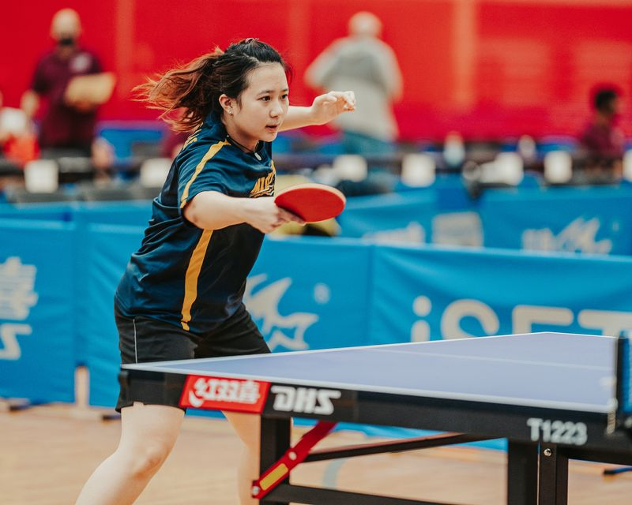
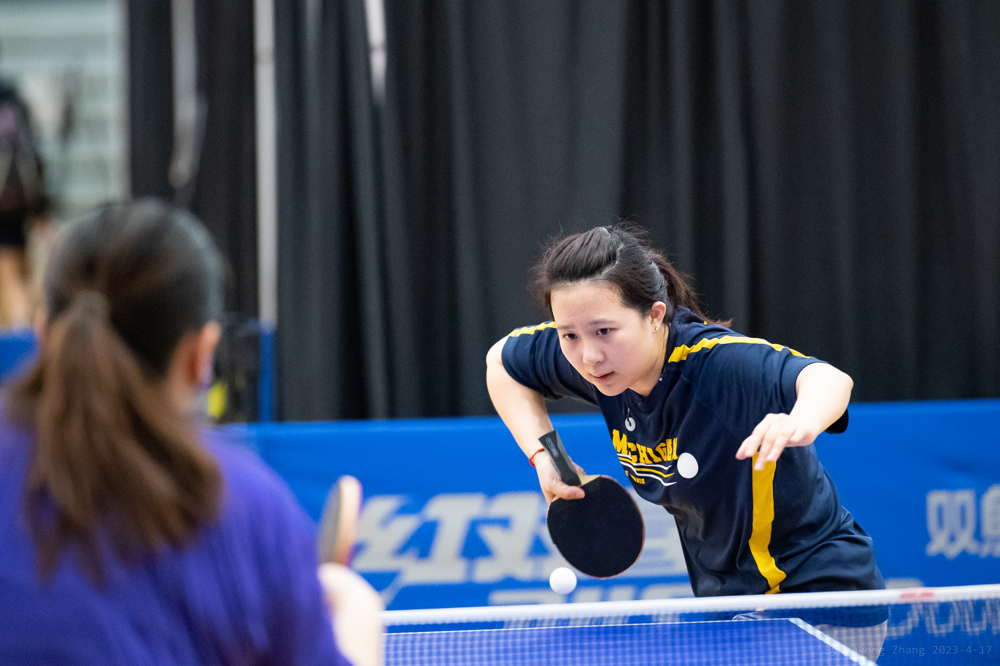

# Hey, everyone! I am Yijia ✨ Nice to meet you!
 💬 <a href="https://www.linkedin.com/in/yijia-gao/"> Linkedin </a>     📫 [Email](mailto:yijiagao@umich.edu)

## Education

I am currently a Master's student in Computer Science at University of Michigan, Ann Arbor.

- **〽️ Master of Computer Science in Engineering** - Sep.2023~(Expected) May. 2025 
  University of Michigan, Ann Arbor

- **〽️ Bachelor of Science in Data Science (Dual Degree)** - Sep. 2021~May. 2023 
  University of Michigan, Ann Arbor

- **Bachelor of Science in Electrical and Computer Engineering (Dual Degree)** - Sep. 2019~Aug. 2023 
  Shanghai Jiao Tong University – UM-SJTU Joint Institute

## Current Work
🔭 I am currently working for  **<a href="https://jieliu6.github.io/"> Liu Lab </a>** under Department of Computational Medicine and Bioinformatics at University of Michigan as a Graduate Student Research Assistant (GSRA). 

🌱 Working on developing the web system for knowledge graph  **<a href="https://gkb.dcmb.med.umich.edu/"> GenomicKB </a>** to accumulate human-readable knowledge about the human genome.

🔥 Co-authored the paper **"GenomicKB: a Knowledge Graph for the Human Genome"** published in the journal "Nucleic Acids Research" (**[DOI](https://doi.org/10.1093/nar/gkac957)**)

## Projects
### Software
- Information Retrieval - Reddit Posting Helper

- Web System - Client-Server Instagram Replica

- Machine Learning - Convolutional Neural Networks

- Cloud and Distributed/Embedded System - Cloud-local Joint Energy Coordination Platform

### Hardware
- Auto-controlled Rover Base

- Off-road Robot Competition - Second Place

## 🔧 Technologies & Tools

## Activities ⚡

🏓🏓🏓Table Tennis 🏓🏓🏓

Professionally trained as an athlete for 7 years from 2008 - 2015. **Still playing till now!!!**

[1] Current rating at <a href = "http://www.nctta.org/">
NCTTA (USA)</a>: **2054**

[2] Represent **University of Michigan Table Tennis Team** in National Collegiate Table Tennis League
- 2023 NCTTA Women's Team 9th
- 2022 NCTTA Coed Team Tied 9th
- 2022 NCTTA Women's Single Tied 9th

[3] Highlight: 2014 Shanghai Municipal Sports Games - Table Tennis 
 - Women's Team 1st
 - Women's Single 2nd
 - Women's Double 2nd

  
  

## Reach out to me!
 💬 <a href="https://www.linkedin.com/in/yijia-gao/"> Linkedin </a>

 📫 [Email](mailto:yijiagao@umich.edu)
<!--
Here are some ideas to get you started:

- 🔭 I’m currently working on ...
- 🌱 I’m currently learning ...
- 👯 I’m looking to collaborate on ...
- 🤔 I’m looking for help with ...
- 💬 Ask me about ...
- 📫 How to reach me: ...
- 😄 Pronouns: ...
- ⚡ Fun fact: ...
-->